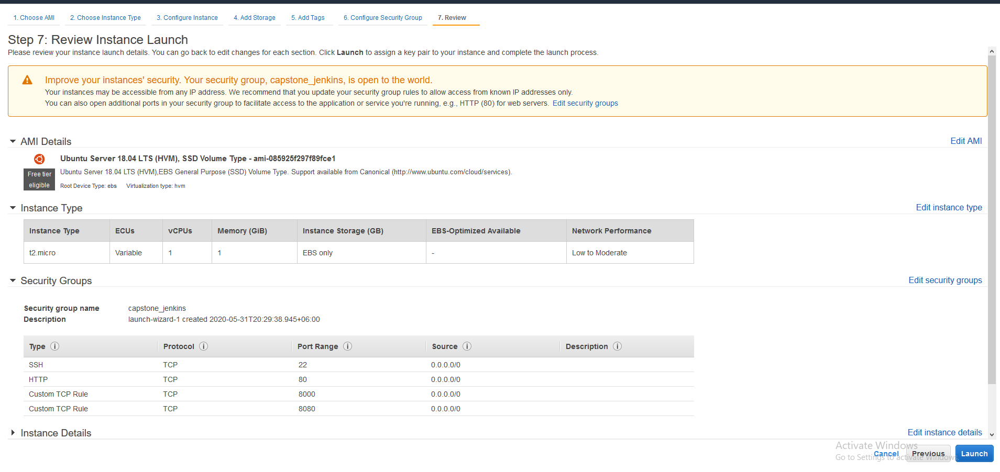
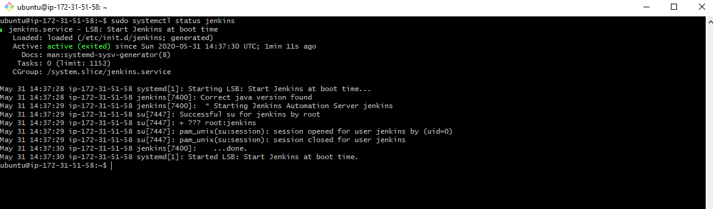
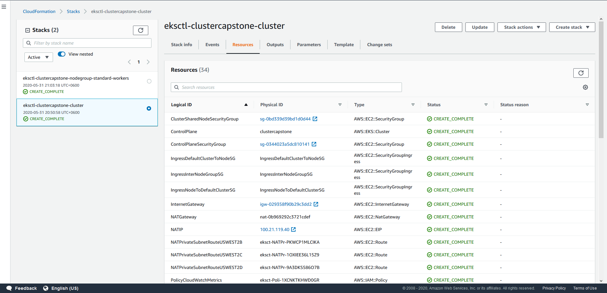
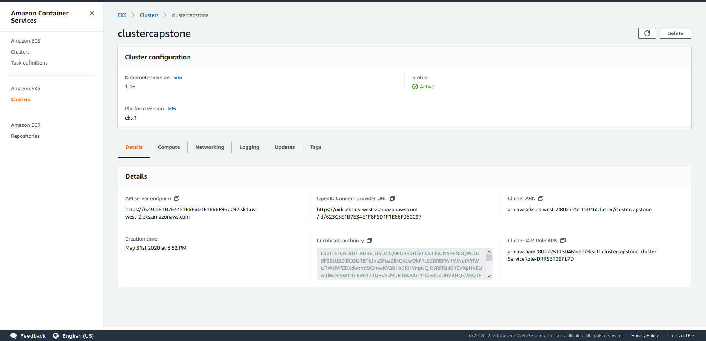
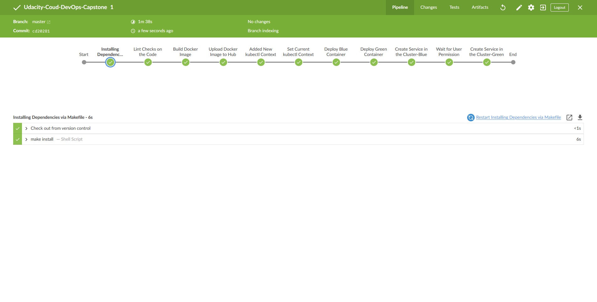
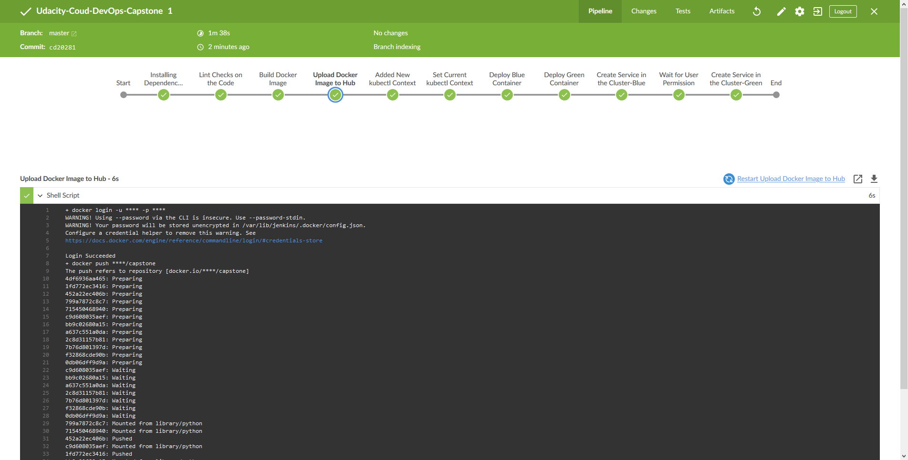
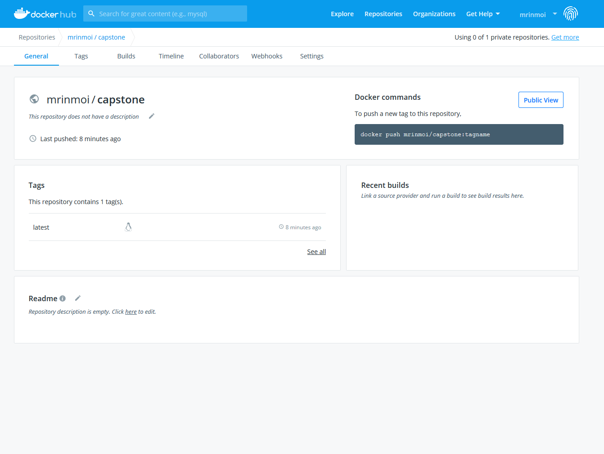
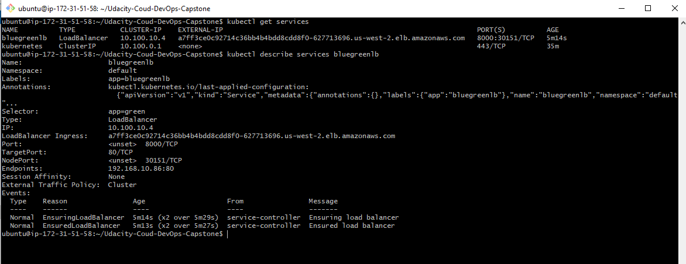
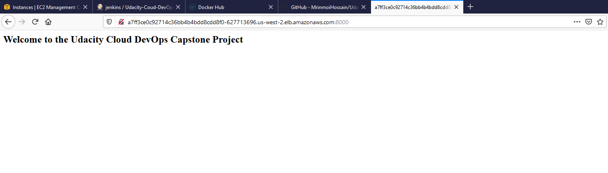

# Deploy a Flask Web App - Udacity Cloud DevOps Capstone Project

## Project Overview
As per capstone project requirement the directions are rather more open-ended than they were in the previous projects in the program. In this project, need to make some of our own choices in this capstone, as deployment implement, services, and the nature of the application development.

So that, develop a CI/CD pipeline for micro services applications with either blue/green deployment or rolling deployment. And, also develop our Continuous Integration steps as our project, but must at least include typographical checking (aka “linting”). 

## Prerequisites
* AWS Account
* GitHub Account
* Docker ID

## Used Tools
* AWS EC2 instance
* Git
* Python (Flask)
* Jenkins
* Docker
* AWS CLI
* AWS CloudFormation
* AWS Elastic Kubernetes Service


## Installation Dependencies

### Install Java
```
$ sudo apt-get install default-jdk -y
```

### Install Jenkins
```
sudo apt-get update
wget -q -O - https://pkg.jenkins.io/debian-stable/jenkins.io.key | sudo apt-key add -
sudo echo "deb https://pkg.jenkins.io/debian-stable binary/" >> /etc/apt/sources.list
sudo apt-get install jenkins -y
sudo systemctl status jenkins
```

### Install Jenkins Plugin
* Blue Ocean
* CloudBees Docker Build and Publish
* pipeline-aws

### Install Python Package Management System (pip)
```
sudo apt-get install python3-pip -y
```

### Install Docker
```
sudo apt-get install docker.io -y
sudo chmod 666 /var/run/docker.sock
```

### Install Hadolint
```
sudo wget -O /bin/hadolint https://github.com/hadolint/hadolint/releases/download/v1.16.3/hadolint-Linux-x86_64
sudo chmod +x /bin/hadolint
```

### Install AWS CLI
```
curl "https://awscli.amazonaws.com/awscli-exe-linux-x86_64.zip" -o "awscliv2.zip"
sudo apt-get install unzip
unzip awscliv2.zip
sudo ./aws/install
aws --version
aws configure
rm awscliv2.zip
```

### Install kubectl
```
curl -o kubectl https://amazon-eks.s3.us-west-2.amazonaws.com/1.16.8/2020-04-16/bin/linux/amd64/kubectl
chmod +x ./kubectl
sudo mv kubectl /bin/
kubectl version --short --client
```

### Install eksctl
```
curl --silent --location "https://github.com/weaveworks/eksctl/releases/latest/download/eksctl_$(uname -s)_amd64.tar.gz" | tar xz -C /tmp
sudo mv /tmp/eksctl /usr/local/bin
eksctl version
```

## Deployment

### Create Cluster
```
eksctl create cluster -f cluster.yaml
```

### Verify kubectl Configuration
```
kubectl get svc
aws eks --region us-west-2 update-kubeconfig --name clustercapstone
```

### Cluster Service Check
```
kubectl get services
kubectl describe services bluegreenlb
```

### Remove Cluster
```
eksctl delete cluster -f cluster.yaml
```

## File Summary
* /Application_deployment_output_images - image of the project output pipeline
* /bgdeployment - Blue-Green deployment configuration file
* Dockerfile - Docker file of the application
* Jenkinsfile - Jenkins pipeline file
* Makefile - Makefile for install and lint check
* app.py - Flask application file
* cluster.yaml - CloudFormation stack file for cluster
* requirements.txt - Python requirements library packages

## Steps to Run the Project
* **Step-1:** Create an EC2 instance (t2.micro) and allow port: 22, 80, 8000, 8080 in the security groups
* **Step-2:** Install jenkins in the EC2 instance and check the jenkins system status
* **Step-3:** Install jenkins requirements plugin
* **Step-4:** Install Python Package Management System
* **Step-5:** Install Docker and Hadolint in the instance
* **Step-6:** Install AWS CLI, kubectl, eksctl
* **Step-7:** Run the ```cluster.yaml``` in the EC2 instance
* **Step-8:** Check the cluster services
* **Step-9:** Set docker and aws credentials in the jenkins credentials
* **Step-10:** Add this GitHub repo to the Blue Ocean pipeline and create pipeline
* **Step-11:** After complete the project remove the cluster

## Demo of the Project Pipeline











## Resources
* [Pylint: command issue](https://jdhao.github.io/2019/11/28/pylint_command_not_found/)
* [Docker: permission denied issue](https://stackoverflow.com/questions/48957195/how-to-fix-docker-got-permission-denied-issue)
* [Getting started with eksctl](https://docs.aws.amazon.com/eks/latest/userguide/getting-started-eksctl.html)
* [eksctl: Creating and managing clusters](https://eksctl.io/usage/creating-and-managing-clusters/)
* [Jenkins pipeline for blue green deployment using AWS EKS — Kubernetes — Docker](https://medium.com/@andresaaap/jenkins-pipeline-for-blue-green-deployment-using-aws-eks-kubernetes-docker-7e5d6a401021)